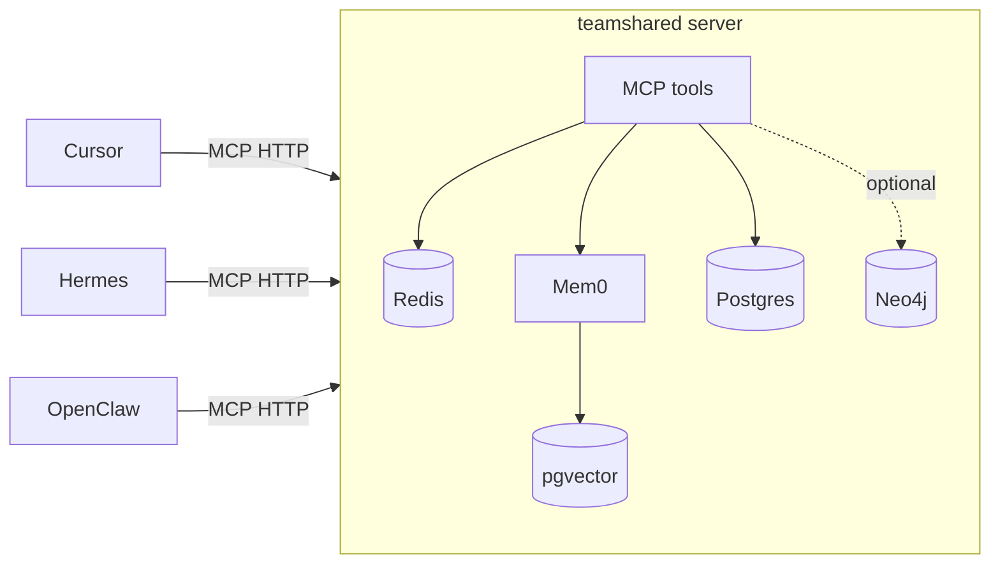

# teamshared

Multi-pillar agent memory, exposed as an MCP server. One shared brain for
Cursor agent, Hermes, OpenClaw, and anything else that speaks MCP.

By default `memory_recall` and `memory_episodes_list` are **unscoped on
durable pillars** (semantic, episodic, procedural): every agent on the same
teamshared deployment sees every other agent's writes. This is the team-wide
context-sharing model — point all your teammates' agents at one Tailnet-
exposed teamshared, mint a token per `(human, agent)` pair, and everyone reads
the same brain. Working memory is the one exception: it stays caller-scoped
because it's per-session conversation buffer, not durable knowledge.

Pass `agent="cursor"` on either tool when you want to narrow recall to a
single agent's history (e.g. for debugging or "what did I write?" queries).

The four memory pillars:

- **Working** — Redis-backed per-session conversation buffer.
- **Semantic** — Mem0-backed facts, preferences, user profiles.
- **Episodic** — Mem0-backed timeline of summarized sessions.
- **Procedural** — Postgres-backed versioned, agent-callable skills.
- **Graph** — optional Neo4j-backed explicit relationships (`memory_graph_*`).



## Quick start

```bash
# 1. Bring up Postgres + Redis + teamshared server + distiller + curator
cp .env.example .env   # then edit (esp. OPENAI_API_KEY)
docker compose -f infra/docker-compose.yml up -d --build

# 2. Apply migrations
docker compose -f infra/docker-compose.yml run --rm server teamshared migrate

# 3. Mint a token for each agent
docker compose -f infra/docker-compose.yml run --rm server teamshared token mint cursor
docker compose -f infra/docker-compose.yml run --rm server teamshared token mint hermes
docker compose -f infra/docker-compose.yml run --rm server teamshared token mint openclaw

# 4. Probe health
curl -fsS http://localhost:8077/health | jq
```

**Ollama on the host (default, uses GPU):** with `TEAMSHARED_EMBED_PROVIDER` /
`TEAMSHARED_LLM_PROVIDER` set to `ollama` in `.env`:

```bash
make ollama-host   # OLLAMA_HOST=0.0.0.0:11434 — bind for containers
make build         # TEAMSHARED_OLLAMA_BASE_URL=http://host.docker.internal:11434
```

- **macOS / Docker Desktop:** `host.docker.internal` routes to host Ollama (Metal).
- **Linux:** make the host Ollama reachable from the docker bridge:
  - start Ollama with `OLLAMA_HOST=0.0.0.0:11434` (bind all interfaces), and
  - allow the docker bridge subnet to port `11434`, e.g.
    `sudo ufw allow from 172.16.0.0/12 to any port 11434 proto tcp`.

**Bundled Ollama (optional, CPU-only on macOS):** `make build-bundled-ollama` and
`TEAMSHARED_OLLAMA_BASE_URL=http://ollama:11434`.

## Connect your agents

### One-command install (curl)

No local clone required — one script prompts for your harness (Cursor, Codex,
Hermes, Claude, OpenClaw), downloads plugin files and MCP config from the server,
and places them in the right paths:

```bash
curl -fsSL https://teamshared.com/install.sh | bash
```

The script prompts for your bearer token ([`/get-token`](https://teamshared.com/get-token))
and writes it into the harness MCP config. Details: [`/install`](https://teamshared.com/install).

To undo everything the installer wrote (plugin, rule, hook, and the `teamshared`
entry in each harness's MCP config) run the matching uninstaller — it prompts
for the harness (or `all`) and only strips the `teamshared` server, leaving the
rest of your config intact:

```bash
curl -fsSL https://teamshared.com/uninstall.sh | bash
```

**Cursor (recommended):** install the **teamshared** plugin. The installer asks
whether to install **globally** (`~/.cursor`, available in every project) or
**locally** (`./.cursor` in the current repo, that project only). For a local
install, add `.cursor/mcp.json` to the repo's `.gitignore` so the bearer token
isn't committed.

**Marketplace:** Settings → Plugins → Add marketplace → `https://github.com/xhad/teamshared`, then `/add-plugin teamshared`.

**Local symlink:**

```bash
ln -sf "$(pwd)/plugins/teamshared" ~/.cursor/plugins/local/teamshared
```

Export `TEAMSHARED_URL` and `TEAMSHARED_TOKEN` before launching Cursor. Requires **Bun** for continual-learning hooks. See [`plugins/teamshared/README.md`](plugins/teamshared/README.md) and [`plugins/teamshared/MARKETPLACE.md`](plugins/teamshared/MARKETPLACE.md).

Manual snippets also live in [`src/teamshared/clients/`](src/teamshared/clients):

- [Cursor](src/teamshared/clients/cursor.mcp.json)
- [Hermes](src/teamshared/clients/hermes.config.yaml)
- [OpenClaw](src/teamshared/clients/openclaw.md)

## MCP tools

| Tool                        | Purpose                                                      |
| --------------------------- | ------------------------------------------------------------ |
| `health`                    | Liveness + dependency check                                  |
| `memory_recall`             | Hybrid search (`repo=` / `github=` softly boost scoped tags) |
| `memory_remember`           | Write a fact / preference / event / note (`repo=` / `github=` scope tags) |
| `memory_session_open`       | Start a working-memory session                               |
| `memory_session_append`     | Append a turn                                                |
| `memory_session_close`      | Close + enqueue for distillation                             |
| `memory_episodes_list`      | Browse the episodic timeline                                 |
| `memory_procedure_get`      | Fetch a stored procedure                                     |
| `memory_procedure_set`      | Store a new version of a procedure                           |
| `memory_procedures_list`    | List all procedures                                          |
| `memory_strategic_statement_get` / `_set` | Active or propose vision/mission/purpose      |
| `memory_strategic_plan_*`   | List/get/propose OKR cycles                                  |
| `memory_strategic_objective_set` | Propose an objective under a plan                     |
| `memory_strategic_key_result_set` | Propose a measurable key result                      |
| `memory_strategic_initiative_set` | Propose a strategic initiative                       |
| `work_list`                 | List org work items (status, assignee, mine, sort, exclude_closed) |
| `work_get`                  | Fetch one work item                                          |
| `work_create`               | Create a task (agent writes → approval; humans → immediate)  |
| `work_update`               | Update status, assignee, priority, etc.                      |
| `work_close`                | Mark done or cancelled (writes episodic timeline event)        |
| `work_comment_add`          | Add a progress comment on a task                             |
| `work_comment_list`         | List comments on a task                                      |
| `memory_graph_relate`       | Add an explicit (subject)-[predicate]->(object) edge (Neo4j) |
| `memory_graph_related`      | Walk the graph from an entity, up to N hops (Neo4j)          |
| `memory_state_get`          | Read token+repo scoped JSON state (client bookkeeping)         |
| `memory_state_set`          | Write token+repo scoped JSON state                           |
| `memory_forget`             | Soft-delete a semantic/episodic memory                       |

## Team console (web UI)

A server-rendered console for humans lives at [`/app`](https://teamshared.com/app)
(Jinja2 + a little HTMX, no build step). Sign in with a **one-time passcode (OTP)**:
enter your email, then type the short numeric code (stored hashed in Redis with
a `TEAMSHARED_OTP_TTL_SECONDS` TTL, single-use, attempt-capped) — no bearer token
needed in the browser. The code is **emailed via SMTP** (`TEAMSHARED_SMTP_*`); in
`auth_disabled` dev mode it's shown on the page instead.

**Self-service, multi-tenant.** Login is open: *any* email can sign in. Your email
is one global **account** (the `accounts` table) that can belong to many orgs. The
first time you sign in you get your own private org (you're the owner); after that
you land in the org(s) you belong to. The header has an **org switcher** to move
between them and a **New org** action to create more.

- **Work** (`/app/work`) — org-wide task queue; assign to people or agent identities.
- **Strategy** (`/app/strategy`) — vision, mission, purpose, and OKR board.
- **Memory wiki** (`/app/wiki`) — semantic facts, the episodic timeline, and
  procedural playbooks rendered as a continuously-updating, human-readable knowledge
  base. Topic pages prefer an LLM-**curated** article (synthesized by the curator
  worker) and fall back to the raw source records grouped by kind. Agent-authored
  markdown is rendered through an allowlist sanitizer.
- **Memory explorer** (`/app/memory`) — keyword search and per-record inspection
  across pillars.
- **Agents** (`/app/agents`) — add or enable/disable agent identities.
- **API keys** (`/app/keys`) — mint (`tsk_…`, shown once) and revoke keys.
- **People & roles** (`/app/people`) — list members, **add a teammate by email**
  (they sign in with their own OTP and land in this org), and grant/revoke roles.
- **Organizations** (`/app/orgs`) — list the orgs your account belongs to, switch
  between them, and create a new one.
- **Approvals** (`/app/approvals`) — approve/reject captured memory before it goes live.
- **Consent** (`/app/consent`) — grant/revoke the capture scopes that gate ingestion.

Each new org is isolated by RLS, so opening signup only lets people create their own
private space — the shared team brain (the default org) is reached only by an admin
**adding your email** to it. Write actions are RBAC-checked (`org:admin` for
agents/keys/roles/members, `memory:approve` for approvals) and audited. Agent/MCP
bearer tokens are unaffected and keep resolving to their bound org. The public,
no-auth memory status page stays at [`/memory`](https://teamshared.com/memory).

## Local development without Docker

```bash
python -m venv .venv && source .venv/bin/activate
pip install -e '.[dev]'

# In one terminal: backing stores
docker compose -f infra/docker-compose.yml up -d postgres redis

teamshared migrate
teamshared token mint dev
teamshared serve --transport http       # uses .env
# or, for direct stdio debugging:
teamshared serve --transport stdio
```

## Deploying

Two reference topologies live in [`infra/`](infra):

- [`tailscale.example.md`](infra/tailscale.example.md) — single always-on
  host running the compose stack, exposed at
  `https://memory.<tailnet>.ts.net/mcp` without opening public ports.
- [`railway.example.md`](infra/railway.example.md) — four Railway services
  (pgvector, Redis, server, distiller) wired up via private networking,
  driven by [`railway.server.toml`](infra/railway.server.toml) and
  [`railway.distiller.toml`](infra/railway.distiller.toml). Bearer auth on
  a public domain replaces Tailscale.

## Operations

- **Mint tokens (HTTP)**: teammates redeem a one-time **invite code** (no admin
  secret needed):

  1. Admin creates an invite: `teamshared token invite-create` (on the server host)
     or `POST /tokens/invites` with `X-Teamshared-Mint-Secret`.
  2. User runs:

  ```bash
  curl -fsS 'https://teamshared.com/?invite=INVITE_CODE&agent=cursor'
  ```

- **Memory dashboard**: `GET /memory` is a public, zero-dependency HTML page
  showing component health, per-pillar counts, simple charts, and the most
  recent saved records. Counts come from direct SQL on the `teamshared_memories`
  and `procedures` tables plus a Redis scan (not the MCP tool surface), so they
  stay accurate even where `get_all` is capped.

- **Conversation capture**: every authenticated MCP tool call is auto-recorded
  into a rolling per-agent working session by a server-side FastMCP middleware
  (harness-agnostic; no client hooks needed). Natural-language turns are
  captured separately: a client adapter reads its harness transcript and pushes
  turns to `POST /sessions/turns` (bearer-scoped, body `{"turns": [{"role",
  "content"}]}`), which lands in the same session. The Cursor plugin ships such
  an adapter as a `stop` hook (`conversation-capture-stop.ts`); Hermes ships one
  as a `post_llm_call` shell hook (`~/.hermes/agent-hooks/teamshared-capture.py`,
  wired by the installer — approve once via `hermes --accept-hooks`); other
  harnesses point their own adapter at the same endpoint. Sessions roll over (close +
  distill, open new) after `TEAMSHARED_CAPTURE_IDLE_SECONDS` of inactivity or
  `TEAMSHARED_CAPTURE_MAX_TURNS` turns; set `TEAMSHARED_CAPTURE_ENABLED=false`
  to disable all capture.

- **Memory wiki curation**: a separate `curator` worker process (alongside the
  `distiller`) keeps the wiki readable. When the distiller writes new facts or
  decisions it marks the affected subjects dirty; after `TEAMSHARED_CURATE_THRESHOLD`
  updates a subject is enqueued (debounced) and the curator calls the LLM to
  (re)synthesize a `wiki_pages` article, versioned with source provenance. Run it
  with `teamshared curator` (the compose stack starts one automatically). Its
  heartbeat shows up in `GET /health`.

See [`AGENTS.md`](AGENTS.md) for the conventions agents (human or LLM) should
follow when modifying this repo.
