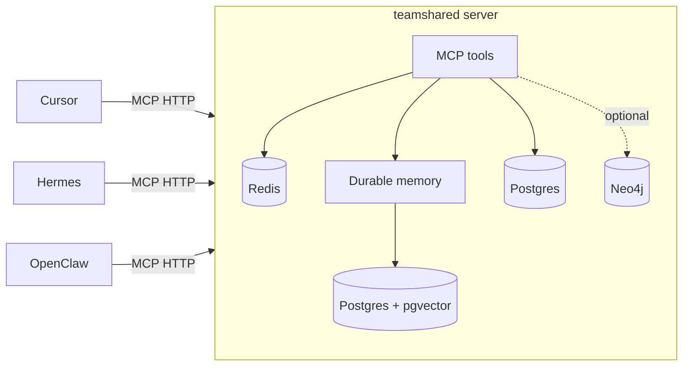

# teamshared

Multi-pillar agent memory, exposed as an MCP server. One shared brain for
Cursor agent, Hermes, OpenClaw, and anything else that speaks MCP.

By default `memory_recall` and `memory_episodes_list` are **unscoped on
durable pillars** (semantic, episodic, procedural): every agent on the same
teamshared deployment sees every other agent's writes. This is the team-wide
context-sharing model — point all your teammates' agents at one Tailnet-
or HTTPS-exposed teamshared deployment, mint a token per agent, and everyone reads
the same brain. Working memory is the one exception: it stays caller-scoped
because it's per-session conversation buffer, not durable knowledge.

Pass `agent="cursor"` on either tool when you want to narrow recall to a
single agent's history (e.g. for debugging or "what did I write?" queries).

The four memory pillars:

- **Working** — Redis-backed per-session conversation buffer.
- **Semantic** — Postgres/pgvector-backed facts, preferences, user profiles.
- **Episodic** — Postgres/pgvector-backed timeline of summarized sessions.
- **Procedural** — Postgres-backed versioned, agent-callable skills.
- **Graph** — optional Neo4j-backed explicit relationships (`memory_graph_*`).



## Quick start

```bash
# 1. Configure and start Postgres + Redis
cp .env.example .env   # edit provider keys and TEAMSHARED_SESSION_SECRET
make migrate

# 2. Create the non-superuser application role and verify RLS
make provision-app-role
make verify-rls

# 3. Start the full stack
make build

# 4. Mint keys in http://localhost:8077/app/keys, then probe health
make health
```

The Makefile always passes `--env-file .env`; use it instead of invoking
`docker compose` directly so repo-root settings and port overrides are applied.

**Ollama on the host (default, uses GPU):** with `TEAMSHARED_EMBED_PROVIDER` /
`TEAMSHARED_LLM_PROVIDER` set to `ollama` in `.env`:

```bash
make ollama-host   # OLLAMA_HOST=0.0.0.0:11434 — bind for containers
make build         # TEAMSHARED_OLLAMA_BASE_URL=http://host.docker.internal:11434
```

- **macOS / Docker Desktop:** `host.docker.internal` routes to host Ollama (Metal).
- **Linux:** make the host Ollama reachable from the docker bridge:
  - start Ollama with `OLLAMA_HOST=0.0.0.0:11434` (bind all interfaces), and
  - allow the docker bridge subnet to port `11434`, e.g.
    `sudo ufw allow from 172.16.0.0/12 to any port 11434 proto tcp`.

**Bundled Ollama (optional, CPU-only on macOS):** `make build-bundled-ollama` and
`TEAMSHARED_OLLAMA_BASE_URL=http://ollama:11434`.

**OpenRouter for the LLM role (hosted, OpenAI-compatible):** set
`TEAMSHARED_LLM_PROVIDER=openrouter`, `OPENROUTER_API_KEY=sk-or-...`, and an
`TEAMSHARED_LLM_MODEL` slug (e.g. `openai/gpt-4o-mini`). The distiller and
curator then call OpenRouter through the OpenAI SDK
(`TEAMSHARED_OPENROUTER_BASE_URL` defaults to `https://openrouter.ai/api/v1`).
OpenRouter has no embeddings endpoint, so keep `TEAMSHARED_EMBED_PROVIDER` on
`openai` or `local`.

**In-process embeddings (lowest recall latency):** set
`TEAMSHARED_EMBED_PROVIDER=local` (requires `pip install 'teamshared[local-embed]'`)
to embed with a fastembed/ONNX model (default `BAAI/bge-small-en-v1.5`,
~3ms/query on CPU) directly inside the server — no network hop. Native vectors
are zero-padded to `TEAMSHARED_EMBED_DIMS` and rows are tagged with the model;
after switching providers run `teamshared reembed` once so existing memories
are re-embedded (search only ranks vectors from the active model). Recall
candidates are additionally served from an in-memory per-org HNSW index
(`teamshared[hnsw]`, write-through, hydrated from Postgres; disable with
`TEAMSHARED_HNSW_CACHE_ENABLED=false`); scope/RLS filtering still happens in
Postgres. Benchmark with `python scripts/bench_recall.py`.

## Connect your agents

### One-command install (curl)

No local clone required. One script prompts for your harness and bearer token.
Cursor installs its memory rule and MCP config globally under `~/.cursor`;
Codex, Hermes, Claude, OpenClaw, and Pi install project-local config under the
current directory:

```bash
# Cursor: run anywhere. Other harnesses: run from the project root.
curl -fsSL https://teamshared.com/install.sh | bash
```

The script prompts for your bearer token (mint under **API Keys** in the [console](https://teamshared.com/app/keys))
and writes it into the harness MCP config. Details: [`/install`](https://teamshared.com/install).
After restarting the harness, verify the deployment with
`teamshared doctor --url https://teamshared.com`; operators may add `--token`
for an authenticated recall check or `--write-smoke` for a temporary
write/recall/delete probe.

To undo the install, run the matching uninstaller. It prompts for the harness
(or `all`) and removes only teamshared-managed files/config entries:

```bash
# Run from the project root for project-local harnesses.
curl -fsSL https://teamshared.com/uninstall.sh | bash
```

**Cursor:** curl installs the rule and MCP config under `~/.cursor`; the bearer
token stays outside repositories. Install the marketplace plugin separately when
you also want its bundled hooks and skills.

**Marketplace:** Settings → Plugins → Add marketplace → `https://github.com/xhad/teamshared`, then `/add-plugin teamshared`.

**Local symlink:**

```bash
ln -sf "$(pwd)/plugins/teamshared" ~/.cursor/plugins/local/teamshared
```

Install the plugin for the recall rule and continual-learning hook (Bun required for the stop hook only). Context compression is MCP-first — see [`docs/context-compression.md`](docs/context-compression.md).

Manual snippets and install templates live under [`plugins/teamshared/`](plugins/teamshared/):

- [Install assets](plugins/teamshared/install/) — served by `install.sh` at `/install/assets/*`
- [Memory rule](plugins/teamshared/rules/teamshared.mdc) — Cursor
- [Client protocol](plugins/teamshared/clients/protocol.md) — Hermes, Claude, others

## MCP tools

| Tool                        | Purpose                                                      |
| --------------------------- | ------------------------------------------------------------ |
| `health`                    | Liveness + dependency check                                  |
| `context_compress`          | Shrink tool outputs/logs before sending a prompt to an LLM   |
| `context_retrieve`          | Fetch original content for a CCR ref from compression        |
| `context_prepare`           | Session append → compress history → enrich org memory        |
| `context_commit`            | Turn-end batch: assistant summary + durable facts + optional close |
| `context_normalize`         | Strip/clean/compress a non-teamshared tool output            |

See **[Context compression](docs/context-compression.md)** for how teamshared reduces token burn in multi-turn agent conversations (MCP tools, middleware, CCR, configuration).
| `version`                   | Server + memory-rule version check                           |
| `memory_tools_catalog`      | Discover tools by tier/group + `tool_recipe` shapes          |
| `memory_recall`             | Hybrid search — raw ranked records (`explain=true` for attribution) |
| `memory_think`              | Synthesized answer with citations + gap analysis (GBrain `think` parity) |
| `memory_remember`           | Write a fact / preference / event / note (`repo=` / `github=` scope tags) |
| `memory_soul_get`           | Private compressed identity (soul) for this person in this org |
| `memory_soul_set`           | Replace private soul (server caps length; keep short) |
| `memory_assemble_context`   | One parallel, token-budgeted, cited context pack across all pillars + graph |
| `memory_session_ensure`     | Bootstrap session; returns `soul` when the API key is account-linked |
| `memory_session_open`       | Start a working-memory session (prefer `memory_session_ensure`) |
| `memory_session_append`     | Append a turn (self-heals expired sessions)                  |
| `memory_session_close`      | Close + enqueue for distillation                             |
| `memory_session_get`        | Read session metadata and turns                              |
| `memory_episodes_list`      | Browse the episodic timeline                                 |
| `memory_procedure_get`      | Fetch a stored playbook (`expand_skills` inlines skills)     |
| `memory_procedure_set`      | Store a new version of a playbook                            |
| `memory_procedures_list`      | List playbooks (summaries by default)                        |
| `memory_playbook_get`       | Alias for `memory_procedure_get`                             |
| `memory_playbook_set`       | Alias for `memory_procedure_set`                             |
| `memory_playbooks_list`     | Alias for `memory_procedures_list`                           |
| `memory_forget_procedure`   | Soft-delete a playbook by name                               |
| `memory_skill_get`          | Fetch a stored skill (atomic building block)                 |
| `memory_skill_set`          | Store a new version of a skill                               |
| `memory_skills_list`        | List skills (summaries by default)                           |
| `memory_skill_resolve`      | Resolve playbook `tool_recipe.skills` to full records        |
| `memory_forget_skill`       | Soft-delete a skill by name                                  |
| `memory_strategic_statement_get` / `_set` | Active or propose vision/mission/purpose      |
| `memory_strategic_plan_*`   | List/get/propose OKR cycles                                  |
| `memory_strategic_objective_set` | Propose an objective under a plan                     |
| `memory_strategic_key_result_set` | Propose a measurable key result                      |
| `memory_strategic_initiative_set` | Propose a strategic initiative                       |
| `memory_strategic_entity_get` | Fetch objective, key_result, initiative, plan, or statement |
| `work_list`                 | List org work items (status, assignee, mine, sort, exclude_closed) |
| `work_get`                  | Fetch one work item                                          |
| `work_create`               | Create a task (active immediately for humans and agents)     |
| `work_update`               | Update status, assignee, priority, etc.                      |
| `work_close`                | Mark done or cancelled (writes episodic timeline event)        |
| `work_comment_add`          | Add a progress comment on a task                             |
| `work_comment_list`         | List comments on a task                                      |
| `work_add_to_project`       | Add a task to a project (tasks can be in multiple projects)  |
| `work_remove_from_project`  | Remove a task from a project                                 |
| `work_move`                 | Move/reorder a task within a project section                 |
| `work_subtasks_list`        | List subtasks (create via `work_create` with `parent_id`)    |
| `work_dependency_add`       | Add a blocker → blocked dependency between tasks             |
| `work_dependency_remove`    | Remove a task dependency                                     |
| `work_dependencies_list`    | List what a task is blocked by and what it blocks            |
| `work_follower_add`         | Add a follower/collaborator (human or agent) to a task       |
| `work_follower_remove`      | Remove a follower from a task                                |
| `work_followers_list`       | List a task's followers                                      |
| `project_create`            | Create a project (Asana-style task container)                |
| `project_list`              | List projects (filter by team/initiative, archived)          |
| `project_get`               | Fetch a project with sections, latest status, and tasks      |
| `project_update`            | Update project metadata                                      |
| `project_archive`           | Archive or restore a project                                 |
| `project_section_add`       | Add an ordered section (list group / board column)           |
| `project_section_list`      | List a project's sections                                    |
| `project_status_post`       | Post an on-track / at-risk / off-track status update         |
| `memory_graph_relate`       | Add an explicit edge (`object_entity` = target) (Neo4j)       |
| `memory_graph_related`      | Walk the graph from an entity, up to N hops (Neo4j)          |
| `memory_state_get`          | Read token+repo scoped JSON state (client bookkeeping)         |
| `memory_state_set`          | Write token+repo scoped JSON state                           |
| `memory_forget`             | Soft-delete a semantic/episodic memory                       |

## Team console (web UI)

A server-rendered console for humans lives at [`/app`](https://teamshared.com/app)
(Jinja2 + a little HTMX, no build step). Sign in with a **one-time passcode (OTP)**:
enter your email, then type the short numeric code (stored hashed in Redis with
a `TEAMSHARED_OTP_TTL_SECONDS` TTL, single-use, attempt-capped) — no bearer token
needed in the browser. The code is **emailed via SMTP** (`TEAMSHARED_SMTP_*`); in
`auth_disabled` dev mode it's shown on the page instead.

**Self-service, multi-tenant.** Login is open: *any* email can sign in. Your email
is one global **account** (the `accounts` table) that can belong to many orgs. The
first time you sign in you get your own private org (you're the owner); after that
you land in the org(s) you belong to. The header has an **org switcher** to move
between them and a **New org** action to create more.

- **Work** (`/app/work`) — org-wide task queue; assign to people or agent identities.
- **Strategy** (`/app/strategy`) — vision, mission, purpose, and OKR board.
- **Memory wiki** (`/app/wiki`) — semantic facts, the episodic timeline, and
  procedural playbooks rendered as a continuously-updating, human-readable knowledge
  base. Topic pages prefer an LLM-**curated** article (synthesized by the curator
  worker) and fall back to the raw source records grouped by kind. Agent-authored
  markdown is rendered through an allowlist sanitizer.
- **Memory explorer** (`/app/memory`) — keyword search and per-record inspection
  across pillars.
- **API keys** (`/app/keys`) — mint (`tsk_…`, shown once) and revoke keys.
- **People & roles** (`/app/people`) — list members, **add a teammate by email**
  (they sign in with their own OTP and land in this org), and grant/revoke roles.
- **Organizations** (`/app/orgs`) — list the orgs your account belongs to, switch
  between them, and create a new one.

Each new org is isolated by RLS, so opening signup only lets people create their own
private space — the shared team brain (the default org) is reached only by an admin
**adding your email** to it. Write actions are RBAC-checked (`org:admin` for
agents/keys/roles/members) and audited. Agent/MCP
bearer tokens are unaffected and keep resolving to their bound org. The public,
no-auth memory status page stays at [`/memory`](https://teamshared.com/memory).

## Local development without Docker

```bash
python -m venv .venv && source .venv/bin/activate
pip install -e '.[dev]'

# In one terminal: backing stores
docker compose --env-file .env -f infra/docker-compose.yml up -d postgres redis

teamshared migrate
teamshared token mint dev
teamshared serve --transport http       # uses .env
# or, for direct stdio debugging:
teamshared serve --transport stdio
```

## Deploying

Two reference topologies live in [`infra/`](infra):

- [`tailscale.example.md`](infra/tailscale.example.md) — single always-on
  host running the compose stack, exposed at
  `https://memory.<tailnet>.ts.net/mcp` without opening public ports.
- [`railway.example.md`](infra/railway.example.md) — five Railway services
  (pgvector, Redis, server, distiller, curator) wired up via private networking,
  driven by [`railway.server.toml`](infra/railway.server.toml) and
  [`railway.distiller.toml`](infra/railway.distiller.toml). Bearer auth on
  a public domain replaces Tailscale.

## Operations

- **Mint tokens (HTTP)**: teammates redeem a one-time **invite code** (no admin
  secret needed):

  1. Admin creates an invite: `teamshared token invite-create` (on the server host)
     or `POST /tokens/invites` with `X-Teamshared-Mint-Secret`.
  2. User runs:

  ```bash
  curl -fsS 'https://teamshared.com/?invite=INVITE_CODE&agent=cursor'
  ```

- **Memory dashboard**: `GET /memory` is a public, zero-dependency HTML page
  showing component health, per-pillar counts, simple charts, and the most
  recent saved records. Counts come from direct SQL on the `teamshared_memories`
  and `procedures` tables plus a Redis scan (not the MCP tool surface), so they
  stay accurate even where `get_all` is capped.

- **Conversation capture**: every authenticated MCP tool call is auto-recorded
  into a rolling per-agent working session by a server-side FastMCP middleware
  (harness-agnostic; no client hooks needed). Natural-language turns are
  captured by the agent via `memory_session_*` per the `teamshared.mdc` rule
  (Cursor plugin) or a client adapter that pushes to `POST /sessions/turns`
  (Hermes ships one as a `post_llm_call` shell hook,
  `~/.hermes/agent-hooks/teamshared-capture.py`, wired by the installer — approve
  once via `hermes --accept-hooks`). Sessions roll over (close + distill, open
  new) after `TEAMSHARED_CAPTURE_IDLE_SECONDS` of inactivity or
  `TEAMSHARED_CAPTURE_MAX_TURNS` turns for middleware/autosession capture; set
  `TEAMSHARED_CAPTURE_ENABLED=false` to disable server-side tool capture.

- **Chat-completions gateway (memory companion)**: `POST /gateway/v1/chat/completions`
  is an OpenAI-compatible proxy for harnesses that support a custom model base
  URL (e.g. OpenClaw's `models.providers.<name>.baseUrl`). Each request is run
  through the pre-LLM pipeline (session append → history compression →
  context-pack enrichment) and forwarded to the configured upstream provider,
  streaming SSE back verbatim; the assistant reply is appended to the same
  working session on completion, so distillation and curation cover the full
  conversation with zero agent cooperation. Conversations are fingerprinted
  from their first user message and mapped to one working session per agent, so
  parallel chats don't interleave. Auth is the same `tsk_*` bearer key agents
  use for MCP. Opt-in: set `TEAMSHARED_GATEWAY_ENABLED=true`,
  `TEAMSHARED_GATEWAY_UPSTREAM_BASE_URL` (OpenAI-compatible, ending in `/v1`),
  `TEAMSHARED_GATEWAY_UPSTREAM_API_KEY`, and optionally
  `TEAMSHARED_GATEWAY_DEFAULT_MODEL`. `GET /gateway/v1/models` answers client
  probes with the default model.

- **Memory wiki curation**: a separate `curator` worker process (alongside the
  `distiller`) keeps the wiki readable. When the distiller writes new facts or
  decisions it marks the affected subjects dirty; after `TEAMSHARED_CURATE_THRESHOLD`
  updates a subject is enqueued (debounced) and the curator calls the LLM to
  (re)synthesize a `wiki_pages` article, versioned with source provenance. Run it
  with `teamshared curator` (the compose stack starts one automatically). Its
  heartbeat shows up in `GET /health`.

See [`AGENTS.md`](AGENTS.md) for the conventions agents (human or LLM) should
follow when modifying this repo.
