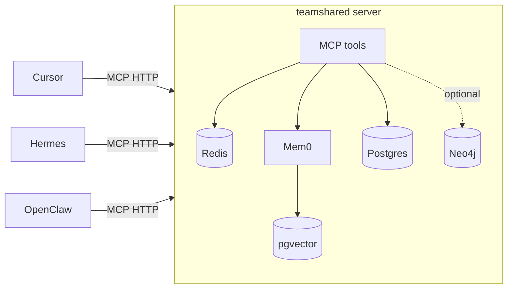

# teamshared

Multi-pillar agent memory, exposed as an MCP server. One shared brain for
Cursor agent, Hermes, OpenClaw, and anything else that speaks MCP.

By default `memory_recall` and `memory_episodes_list` are **unscoped on
durable pillars** (semantic, episodic, procedural): every agent on the same
teamshared deployment sees every other agent's writes. This is the team-wide
context-sharing model — point all your teammates' agents at one Tailnet-
exposed teamshared, mint a token per `(human, agent)` pair, and everyone reads
the same brain. Working memory is the one exception: it stays caller-scoped
because it's per-session conversation buffer, not durable knowledge.

Pass `agent="cursor"` on either tool when you want to narrow recall to a
single agent's history (e.g. for debugging or "what did I write?" queries).

The four memory pillars:

- **Working** — Redis-backed per-session conversation buffer.
- **Semantic** — Mem0-backed facts, preferences, user profiles.
- **Episodic** — Mem0-backed timeline of summarized sessions.
- **Procedural** — Postgres-backed versioned, agent-callable skills.
- **Graph** — optional Neo4j-backed explicit relationships (`memory_graph_*`).



## Quick start

```bash
# 1. Bring up Postgres + Redis + teamshared server + distiller
cp .env.example .env   # then edit (esp. OPENAI_API_KEY)
docker compose -f infra/docker-compose.yml up -d --build

# 2. Apply migrations
docker compose -f infra/docker-compose.yml run --rm server teamshared migrate

# 3. Mint a token for each agent
docker compose -f infra/docker-compose.yml run --rm server teamshared token mint cursor
docker compose -f infra/docker-compose.yml run --rm server teamshared token mint hermes
docker compose -f infra/docker-compose.yml run --rm server teamshared token mint openclaw

# 4. Probe health
curl -fsS http://localhost:8077/health | jq
```

**Ollama in Docker:** set `TEAMSHARED_EMBED_PROVIDER` / `TEAMSHARED_LLM_PROVIDER` to `ollama` in `.env` and
run Ollama on the host. The image installs the `ollama` Python client Mem0 needs at startup.

- **macOS / Docker Desktop:** `make build` — compose sets `host.docker.internal` via `extra_hosts`.
- **Linux (host Ollama):** if `curl` from the server container to Ollama times out, use host
  networking for server + distiller:

  ```bash
  make build-ollama-host
  ```

## Connect your agents

### One-command install (curl)

No local clone required — one script prompts for your harness (Cursor, Codex,
Hermes, Claude, OpenClaw), downloads plugin files and MCP config from the server,
and places them in the right paths:

```bash
curl -fsSL https://actx.teamshared.com/install.sh | bash
```

The script prompts for your bearer token ([`/get-token`](https://actx.teamshared.com/get-token))
and writes it into the harness MCP config. Details: [`/install`](https://actx.teamshared.com/install).

**Cursor (recommended):** install the **teamshared** plugin.

**Marketplace:** Settings → Plugins → Add marketplace → `https://github.com/xhad/actx`, then `/add-plugin teamshared`.

**Local symlink:**

```bash
ln -sf "$(pwd)/plugins/teamshared" ~/.cursor/plugins/local/teamshared
```

Export `TEAMSHARED_URL` and `TEAMSHARED_TOKEN` before launching Cursor. Requires **Bun** for continual-learning hooks. See [`plugins/teamshared/README.md`](plugins/teamshared/README.md) and [`plugins/teamshared/MARKETPLACE.md`](plugins/teamshared/MARKETPLACE.md).

Manual snippets also live in [`src/teamshared/clients/`](src/teamshared/clients):

- [Cursor](src/teamshared/clients/cursor.mcp.json)
- [Hermes](src/teamshared/clients/hermes.config.yaml)
- [OpenClaw](src/teamshared/clients/openclaw.md)

## MCP tools

| Tool                        | Purpose                                                      |
| --------------------------- | ------------------------------------------------------------ |
| `health`                    | Liveness + dependency check                                  |
| `memory_recall`             | Hybrid search across all pillars                             |
| `memory_remember`           | Write a fact / preference / event / note                     |
| `memory_session_open`       | Start a working-memory session                               |
| `memory_session_append`     | Append a turn                                                |
| `memory_session_close`      | Close + enqueue for distillation                             |
| `memory_episodes_list`      | Browse the episodic timeline                                 |
| `memory_procedure_get`      | Fetch a stored procedure                                     |
| `memory_procedure_set`      | Store a new version of a procedure                           |
| `memory_procedures_list`    | List all procedures                                          |
| `memory_graph_relate`       | Add an explicit (subject)-[predicate]->(object) edge (Neo4j) |
| `memory_graph_related`      | Walk the graph from an entity, up to N hops (Neo4j)          |
| `memory_state_get`          | Read token+repo scoped JSON state (client bookkeeping)         |
| `memory_state_set`          | Write token+repo scoped JSON state                           |
| `memory_forget`             | Soft-delete a semantic/episodic memory                       |

## Local development without Docker

```bash
python -m venv .venv && source .venv/bin/activate
pip install -e '.[dev]'

# In one terminal: backing stores
docker compose -f infra/docker-compose.yml up -d postgres redis

teamshared migrate
teamshared token mint dev
teamshared serve --transport http       # uses .env
# or, for direct stdio debugging:
teamshared serve --transport stdio
```

## Deploying

Two reference topologies live in [`infra/`](infra):

- [`tailscale.example.md`](infra/tailscale.example.md) — single always-on
  host running the compose stack, exposed at
  `https://memory.<tailnet>.ts.net/mcp` without opening public ports.
- [`railway.example.md`](infra/railway.example.md) — four Railway services
  (pgvector, Redis, server, distiller) wired up via private networking,
  driven by [`railway.server.toml`](infra/railway.server.toml) and
  [`railway.distiller.toml`](infra/railway.distiller.toml). Bearer auth on
  a public domain replaces Tailscale.

## Operations

- **Mint tokens (HTTP)**: teammates redeem a one-time **invite code** (no admin
  secret needed):

  1. Admin creates an invite: `teamshared token invite-create` (on the server host)
     or `POST /tokens/invites` with `X-Teamshared-Mint-Secret`.
  2. User runs:

  ```bash
  curl -fsS 'https://actx.teamshared.com/?invite=INVITE_CODE&agent=cursor'
  ```

- **Memory dashboard**: `GET /memory` is a public, zero-dependency HTML page
  showing component health, per-pillar counts, simple charts, and the most
  recent saved records. Counts come from direct SQL on the `teamshared_memories`
  and `procedures` tables plus a Redis scan (not the MCP tool surface), so they
  stay accurate even where `get_all` is capped.

- **Conversation capture**: every authenticated MCP tool call is auto-recorded
  into a rolling per-agent working session by a server-side FastMCP middleware
  (harness-agnostic; no client hooks needed). Natural-language turns are
  captured separately: a client adapter reads its harness transcript and pushes
  turns to `POST /sessions/turns` (bearer-scoped, body `{"turns": [{"role",
  "content"}]}`), which lands in the same session. The Cursor plugin ships such
  an adapter as a `stop` hook (`conversation-capture-stop.ts`); Hermes ships one
  as a `post_llm_call` shell hook (`~/.hermes/agent-hooks/teamshared-capture.py`,
  wired by the installer — approve once via `hermes --accept-hooks`); other
  harnesses point their own adapter at the same endpoint. Sessions roll over (close +
  distill, open new) after `TEAMSHARED_CAPTURE_IDLE_SECONDS` of inactivity or
  `TEAMSHARED_CAPTURE_MAX_TURNS` turns; set `TEAMSHARED_CAPTURE_ENABLED=false`
  to disable all capture.

See [`AGENTS.md`](AGENTS.md) for the conventions agents (human or LLM) should
follow when modifying this repo.
