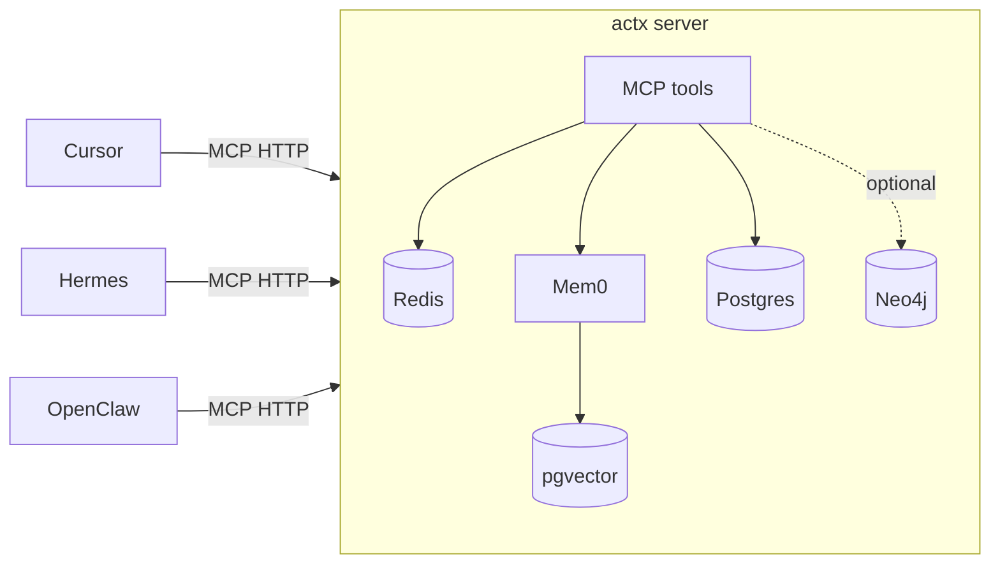

# actx

Multi-pillar agent memory, exposed as an MCP server. One shared brain for
Cursor agent, Hermes, OpenClaw, and anything else that speaks MCP.

By default `memory_recall` and `memory_episodes_list` are **unscoped on
durable pillars** (semantic, episodic, procedural): every agent on the same
actx deployment sees every other agent's writes. This is the team-wide
context-sharing model — point all your teammates' agents at one Tailnet-
exposed actx, mint a token per `(human, agent)` pair, and everyone reads
the same brain. Working memory is the one exception: it stays caller-scoped
because it's per-session conversation buffer, not durable knowledge.

Pass `agent="cursor"` on either tool when you want to narrow recall to a
single agent's history (e.g. for debugging or "what did I write?" queries).

The pillars (see [`plan.md`](plan.md)):

- **Working** — Redis-backed per-session conversation buffer.
- **Semantic** — Mem0-backed facts, preferences, user profiles.
- **Episodic** — Mem0-backed timeline of summarized sessions.
- **Procedural** — Postgres-backed versioned, agent-callable skills.
- **Graph** — optional Neo4j-backed explicit relationships (`memory_graph_*`).



## Quick start

```bash
# 1. Bring up Postgres + Redis + actx server + distiller
cp .env.example .env   # then edit (esp. OPENAI_API_KEY)
docker compose -f infra/docker-compose.yml up -d --build

# 2. Apply migrations
docker compose -f infra/docker-compose.yml run --rm server actx migrate

# 3. Mint a token for each agent
docker compose -f infra/docker-compose.yml run --rm server actx token mint cursor
docker compose -f infra/docker-compose.yml run --rm server actx token mint hermes
docker compose -f infra/docker-compose.yml run --rm server actx token mint openclaw

# 4. Probe health
curl -fsS http://localhost:8077/health | jq
```

**Ollama in Docker:** set `ACTX_EMBED_PROVIDER` / `ACTX_LLM_PROVIDER` to `ollama` in `.env` and
run Ollama on the host. The image installs the `ollama` Python client Mem0 needs at startup.

- **macOS / Docker Desktop:** `make build` — compose sets `host.docker.internal` via `extra_hosts`.
- **Linux (host Ollama):** if `curl` from the server container to Ollama times out, use host
  networking for server + distiller:

  ```bash
  make build-ollama-host
  ```

## Connect your agents

Snippets live in [`src/actx/clients/`](src/actx/clients):

- [Cursor](src/actx/clients/cursor.mcp.json)
- [Hermes](src/actx/clients/hermes.config.yaml)
- [OpenClaw](src/actx/clients/openclaw.md)

Each agent gets its own bearer token so memory writes are attributable.

## MCP tools

| Tool                        | Purpose                                                      |
| --------------------------- | ------------------------------------------------------------ |
| `health`                    | Liveness + dependency check                                  |
| `memory_recall`             | Hybrid search across all pillars                             |
| `memory_remember`           | Write a fact / preference / event / note                     |
| `memory_session_open`       | Start a working-memory session                               |
| `memory_session_append`     | Append a turn                                                |
| `memory_session_close`      | Close + enqueue for distillation                             |
| `memory_episodes_list`      | Browse the episodic timeline                                 |
| `memory_procedure_get`      | Fetch a stored procedure                                     |
| `memory_procedure_set`      | Store a new version of a procedure                           |
| `memory_procedures_list`    | List all procedures                                          |
| `memory_graph_relate`       | Add an explicit (subject)-[predicate]->(object) edge (Neo4j) |
| `memory_graph_related`      | Walk the graph from an entity, up to N hops (Neo4j)          |
| `memory_forget`             | Soft-delete a semantic/episodic memory                       |

## Local development without Docker

```bash
python -m venv .venv && source .venv/bin/activate
pip install -e '.[dev]'

# In one terminal: backing stores
docker compose -f infra/docker-compose.yml up -d postgres redis

actx migrate
actx token mint dev
actx serve --transport http       # uses .env
# or, for direct stdio debugging:
actx serve --transport stdio
```

## Deploying

Two reference topologies live in [`infra/`](infra):

- [`tailscale.example.md`](infra/tailscale.example.md) — single always-on
  host running the compose stack, exposed at
  `https://memory.<tailnet>.ts.net/mcp` without opening public ports.
- [`railway.example.md`](infra/railway.example.md) — four Railway services
  (pgvector, Redis, server, distiller) wired up via private networking,
  driven by [`railway.server.toml`](infra/railway.server.toml) and
  [`railway.distiller.toml`](infra/railway.distiller.toml). Bearer auth on
  a public domain replaces Tailscale.

Both are starting points; actx is just an HTTP/MCP service plus a worker,
so it'll run anywhere that can host two containers and reach Postgres +
Redis.

## Layout

```
src/actx/
  config.py            settings (env-driven)
  auth.py              per-agent bearer tokens + middleware
  logging.py           structlog setup
  memory/
    working.py         Redis-backed working memory
    semantic.py        Mem0 wrapper (semantic + episodic)
    procedural.py      Postgres-backed procedures
    recall.py          cross-pillar hybrid search
    types.py           shared pydantic schemas
  distill/
    worker.py          background summarization worker
    summarizer.py      LLM call + JSON parsing
    prompts.py         distiller system prompt
  server/
    app.py             FastMCP + Starlette assembly
    tools.py           @mcp.tool definitions
    state.py           shared per-process singletons
  cli.py               `actx` entrypoint (typer)
  clients/             config snippets per agent
infra/
  Dockerfile
  docker-compose.yml
  migrations/001_init.sql
  tailscale.example.md
  telemetry.py         optional OTel hooks
  seed/                bundled starter procedures (`actx seed`)
infra/
  Dockerfile
  docker-compose.yml
  migrations/001_init.sql
  tailscale.example.md
eval/
  golden.yaml          scenarios for `eval/run.py`
  run.py               live or in-memory eval runner
scripts/
  smoke_cross_agent.py shared-brain end-to-end smoke
  backup.sh            nightly pg_dump + redis rdb tarball
tests/                 pytest suite
```

## Operations

- **Backup**: cron `scripts/backup.sh` nightly. See the file header for env vars.
- **Telemetry**: install `pip install '.[otel]'` and set
  `OTEL_EXPORTER_OTLP_ENDPOINT`. Spans are emitted for every ASGI request.
- **Eval**: `python eval/run.py` against a running server (set
  `ACTX_EVAL_URL`/`ACTX_EVAL_TOKEN`). `--in-memory` runs the framework
  against a fake bag-of-words retriever -- useful for CI structure checks but
  not for real recall quality.
- **Cross-agent smoke**: `python scripts/smoke_cross_agent.py --in-memory`
  for CI; live with `ACTX_SMOKE_URL`/`ACTX_SMOKE_TOKEN_CURSOR`/`ACTX_SMOKE_TOKEN_HERMES`.
- **Graph store (Neo4j)**: opt-in. Set `ACTX_NEO4J_ENABLED=true`, uncomment the
  `neo4j` service in `infra/docker-compose.yml`, and install the extra:
  `pip install '.[neo4j]'`. Exposes `memory_graph_relate` and `memory_graph_related`.

See [`AGENTS.md`](AGENTS.md) for the conventions agents (human or LLM) should
follow when modifying this repo.
