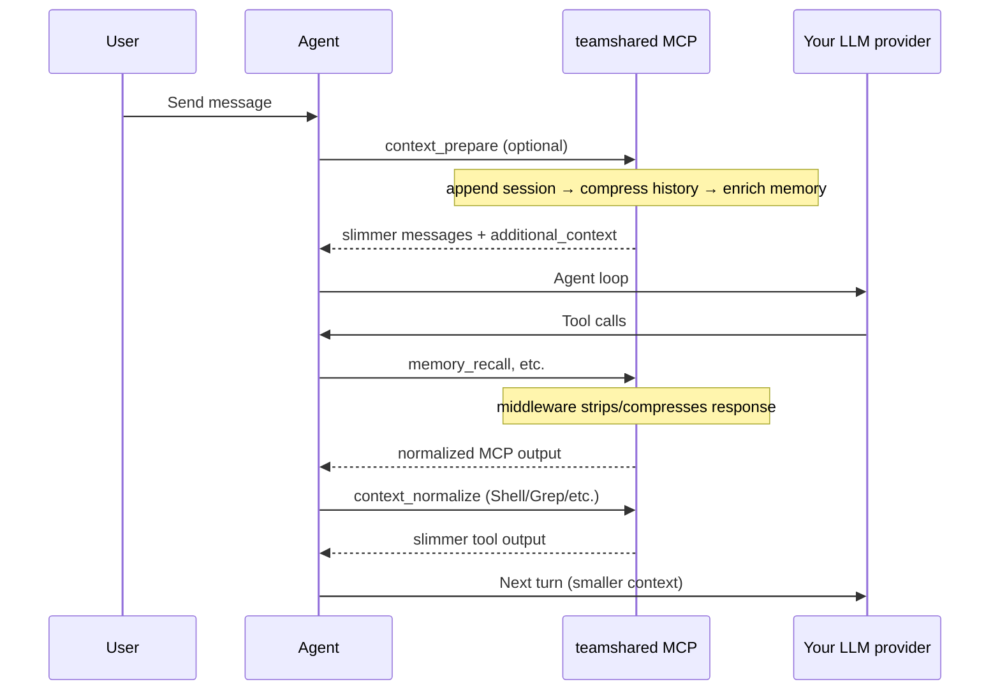

# Context compression in teamshared

teamshared reduces **token burn** in long, multi-turn agent conversations by shrinking the bulky parts of context—tool outputs, logs, and JSON blobs—while keeping user intent, curated team memory, and recoverable originals intact.

This is not a replacement for your LLM provider. Cursor (and other harnesses) still call OpenAI, Anthropic, or OpenRouter directly. teamshared sits **beside** the model path: it compresses what agents accumulate across turns, enriches prompts with durable org memory, and stores full payloads when you need them back.

---

## The problem: context grows every turn

In a typical agent loop:

1. The user sends a message.
2. The model calls tools (grep, read file, MCP memory recall, shell).
3. Tool results—often **much larger** than the user's question—are appended to context.
4. The model replies and may call more tools.
5. Repeat.

Each turn resends the **entire** conversation history. A 500-line grep result or a fat `memory_recall` JSON payload can cost tens of thousands of tokens on every subsequent turn—even when the model only needed a summary.

teamshared targets that **accumulated bloat**: prior tool output, assistant/system blocks, and noisy MCP responses. User messages are preserved verbatim.

---

## Design principles

| Principle | What it means |
|---|---|
| **Compress history, not intent** | User turns stay intact. We shrink tool/system/assistant bulk. |
| **Protect curated memory** | Blocks tagged `## TeamShared context` (assembled recall packs) are never truncated. |
| **Lossy but recoverable** | Compressed text includes a `ref=ccr_…` pointer; originals live in Redis (CCR). |
| **MCP-first** | Agents call MCP tools; server middleware handles teamshared tool responses automatically. |
| **Always on** | Compression runs by default on internal LLM calls and tool normalization; thresholds are tunable. |

---

## Where compression runs



### 1. MCP response middleware (teamshared tools)

Every response from teamshared MCP tools (e.g. `memory_recall`, `memory_think`) passes through server middleware **before** it reaches the agent:

- Remove heavy fields (`embedding`, raw vectors, internal payloads).
- Trim long `content` fields in recall records (default **600 chars** each).
- Compress remaining JSON/log bulk when above size thresholds.

This runs automatically for all harnesses—no client hooks required.

### 2. MCP tools (explicit control)

Agents call these when they orchestrate context themselves:

| Tool | Purpose |
|---|---|
| `context_prepare` | Full pre-LLM pipeline: session append → compress incoming history → enrich org memory |
| `context_normalize` | Strip/clean/compress a **non-teamshared** tool output (Shell, Grep, Read, etc.) |
| `context_compress` | Shrink an arbitrary message list before a model call |
| `context_retrieve` | Expand a `ref=ccr_…` back to the original |

HTTP mirrors exist for scripts and tests: `POST /llm/prepare`, `POST /tools/normalize`, `POST /compress`.

### 3. Internal LLM paths (distiller, curator, thinker)

Background workers and server-side LLM calls (`create_chat_completion`) **always** compress prompts before sending to the configured provider—same engine as the public APIs.

---

## The prepare pipeline (`context_prepare`)

When an agent calls `context_prepare`, teamshared runs three steps **in order**:

```
session append  →  compress incoming  →  enrich with team memory
```

1. **Session append** — Log the user turn to working memory (Redis). Opens or continues `conversation/active-session` for the workspace. Feeds distillation into durable semantic/episodic memory later.

2. **Compress incoming** — Walk non-user messages in the current payload. Apply SmartCrusher-lite and log compression (see below). User messages are skipped.

3. **Enrich** — Assemble a token-budgeted context pack from org memory (recall across semantic, episodic, skills, work, etc.) and return it as `additional_context` under `## TeamShared context`. **This block is never compressed**—it is curated, budget-limited input, not accidental bloat.

The `teamshared.mdc` rule covers session logging via `memory_session_*`; `context_prepare` bundles that with compression and enrichment when you want one call before a model turn.

---

## Tool output normalization (`context_normalize`)

For large outputs from harness tools (not teamshared MCP):

**Clean (strip)**

- Drop embeddings and internal vectors from recall-shaped JSON.
- Truncate per-record `content` / `body_md` fields.
- Remove empty nested objects.

**Compress**

- JSON arrays: statistical sampling (keep head, tail, errors, representative middle rows).
- Logs: keep error/warning lines plus head/tail sampling.
- Plain text: head/tail truncation with a clear marker.

**Protect**

- Payloads containing `## TeamShared context` are never compressed (same rule as the prepare pipeline).

teamshared MCP responses are normalized by middleware automatically; call `context_normalize` for Shell/Grep/Read output the agent keeps in context.

---

## SmartCrusher-lite (what “compression” actually does)

teamshared uses lightweight, deterministic strategies—no extra LLM call to compress:

| Content type | Strategy |
|---|---|
| **JSON arrays** | Keep ~20 items by default; bias toward errors and diverse samples; annotate original count |
| **Log files** | Keep ~40 lines; prioritize lines matching error/failure patterns |
| **Long plain text** | Head + tail truncation toward ~35% of original length (above minimum size) |
| **Short blocks** | Pass through unchanged (below `compress_min_chars`, default 800) |

Compression is **mandatory** when thresholds apply—there is no global off switch. Tune thresholds instead.

---

## Compress–Cache–Retrieve (CCR)

When content is compressed, the **full original** is stored in Redis under a reference like:

```text
ref=ccr_00000000_a1b2c3d4e5f67890
```

- **TTL**: default 1 hour (`TEAMSHARED_COMPRESS_CCR_TTL_SECONDS`).
- **Retrieve**: `context_retrieve(ref=…)` or `GET /compress/retrieve?ref=…`.
- **Why**: The model sees a small summary; the agent can pull the full payload if it needs to drill down.

Nothing is silently deleted—it's swapped for a pointer.

---

## Multi-turn savings (why this matters)

Consider a 10-turn agent session where turn 3 runs a grep that returns 500 JSON rows (~8k tokens):

| Without compression | With teamshared |
|---|---|
| Turns 4–10 each resend the full 8k | Turns 4–10 resend ~500–1k tokens (compressed) |
| **~56k tokens** on grep alone | **~7k tokens** on grep alone |

Exact savings depend on payload shape and settings. Integration benchmarks in this repo target **50–85% token reduction** on realistic grep, log, and recall payloads (estimated as chars ÷ 4).

Memory enrichment is **budgeted** separately (`TEAMSHARED_LLM_PREPARE_CONTEXT_TOKEN_BUDGET`, default 1500 tokens)—you add relevant team knowledge without unbounded recall dumps.

---

## What teamshared does *not* do (today)

- **It does not proxy every LLM request.** There is no OpenAI-compatible gateway to configure in Cursor.
- **It cannot shrink Cursor's hidden system prompt** or provider-side caching.
- **Compression is agent-initiated** for prepare/normalize unless you rely on automatic MCP middleware for teamshared tools.

For guaranteed compression on **every** model token, a provider-proxy architecture is a separate, optional direction. The current design optimizes for **low-friction install** and **tool-output bloat**, which is where multi-turn burn concentrates.

---

## Configuration

All settings use the `TEAMSHARED_` prefix in your server environment.

| Variable | Default | Purpose |
|---|---|---|
| `TEAMSHARED_LLM_PREPARE_ENABLED` | `true` | Enable `context_prepare` / `POST /llm/prepare` |
| `TEAMSHARED_LLM_PREPARE_CONTEXT_TOKEN_BUDGET` | `1500` | Max tokens for assembled memory pack |
| `TEAMSHARED_COMPRESS_MIN_CHARS` | `800` | Minimum block size before compression applies |
| `TEAMSHARED_COMPRESS_JSON_MAX_ITEMS` | `20` | Max JSON array items after sampling |
| `TEAMSHARED_COMPRESS_LOG_MAX_LINES` | `40` | Max log lines after compression |
| `TEAMSHARED_COMPRESS_TARGET_RATIO` | `0.35` | Target fraction for plain-text truncation |
| `TEAMSHARED_COMPRESS_CCR_TTL_SECONDS` | `3600` | How long CCR originals live in Redis |
| `TEAMSHARED_MCP_TOOL_OUTPUT_NORMALIZE_ENABLED` | `true` | MCP middleware strip/clean/compress |
| `TEAMSHARED_MCP_TOOL_OUTPUT_MAX_RECORD_CHARS` | `600` | Per-record content cap in recall JSON |

---

## Setup checklist (Cursor)

1. Run a teamshared server ([quick start](../README.md#quick-start)) or use [teamshared.com](https://teamshared.com).
2. Mint a bearer token (`tsk_…`) from the [console](https://teamshared.com/app) → API Keys.
3. Add MCP config to `~/.cursor/mcp.json` with inline `Authorization`.
4. Optionally install the teamshared Cursor plugin for the recall rule and continual learning (`/add-plugin teamshared` or symlink from this repo). Bun is only needed for the continual-learning stop hook.
5. Reload Cursor — confirm MCP is connected.

---

## Verify it works

**Health**

```bash
curl -fsS https://teamshared.com/health | jq
```

**Normalize a fat recall payload**

```bash
curl -fsS -X POST https://teamshared.com/tools/normalize \
  -H "Authorization: Bearer tsk_..." \
  -H "Content-Type: application/json" \
  -d '{"tool_name":"MCP:memory_recall","output":"{\"records\":[{\"id\":\"m1\",\"content\":\"'"$(python3 -c 'print("x"*2000)')"'\",\"embedding\":[0.1]}]}"}' | jq '.cleaned, .stats'
```

**Run integration benchmarks** (requires local Postgres + Redis):

```bash
pytest -m integration tests/test_compression_integration.py -v -s
```

The summary test prints a token-savings table per scenario.

---

## Related reading

- [Plugin bundle](../plugins/teamshared/README.md) — recall rule, continual learning
- [MCP tool reference](../README.md#mcp-tools) — `context_*` tools
- [AGENTS.md](../AGENTS.md) — architecture overview for contributors

---

## Summary

teamshared attacks **multi-turn token burn** at the source: fat tool outputs and replayed history. It compresses with deterministic, recoverable strategies; enriches with budgeted team memory; and integrates via MCP tools and middleware—without replacing your model provider. User intent stays clear, curated memory stays intact, and originals stay one `ref` away when the agent needs more detail.
